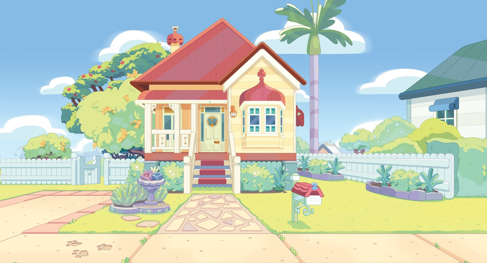

# BlueyHouse3D

A 3D study project recreating the front facade of the Bluey House using OpenSCAD and BOLS2.

## About This Project

This is a fun study project focused on recreating the iconic Bluey House in 3D. The Bluey House is famously non-deterministic - it's impossible to design a complete 3D model based on the episodes alone, as the floor plan doesn't make logical sense. While many people online have attempted to make sense of the house's layout, none have been truly successful.

**Project Goal**: Design only the front facade of the house based on the design reference, not attempting to recreate the problematic back/interior layout.

## Current Status

🚧 **Work in Progress** 🚧

*3D model coming soon...*

## Dependencies

This project requires:

- **[OpenSCAD Developer Nightly](https://openscad.org/downloads.html#snapshots)** - The latest development version for advanced features
- **[BOLS2](https://github.com/revarbat/BOSL2)** - The OpenSCAD Library v2 for additional modeling capabilities

### Installation

1. Download and install OpenSCAD Developer Nightly from the [official website](https://openscad.org/downloads.html#snapshots)
2. Install BOLS2 library following the [installation guide](https://github.com/revarbat/BOSL2#installation)

## Contributing

Want to help design the back of the house? I'd love the assistance! Feel free to open a Pull Request with your contributions.

## MakerWorld

*MakerWorld link coming soon...*

## License

This project is licensed under the MIT License - see the [LICENSE](LICENSE) file for details.

---

*This is a fan project created for educational and entertainment purposes. Bluey is a trademark of Ludo Studio.*